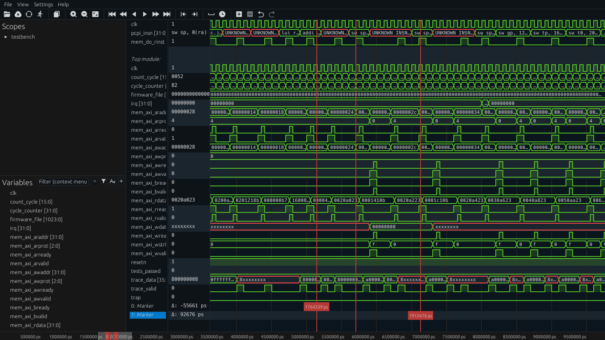

# Surfer


Voltai's Fork of surfer - to enable greater integration with vscode.

[open source when we deploy as a commercial product, as per eupl license]


A waveform viewer with a focus on a snappy usable interface, and extensibility.



## Documentation

There are automatically generated [source documentation](https://docs.surfer-project.org/surfer/)
and an extremely early version of [user documentation](https://docs.surfer-project.org/book/).

## Development Discussion

Contributions are more than welcome! The easiest way is to just create an issue
to discuss a change, or just make merge request with your changes directly. If
you want more in-depth discussion we have bi-weekly meetings to coordinate
development, see [meeting notes](https://hackmd.io/k_C-F7CdS9KVSRJu08tKGg) for more details. You
can also hop in our [matrix channel](https://matrix.to/#/#surfer-project:matrix.org) for asynchronous discussions.

## Installation

If you just want to try things out, you can try surfer right in the web-browser
at <https://app.surfer-project.org/>. However, performance is a bit worse than
native, and some features are missing so for day-to-day use it is recommended
to install the native version.

The primary way to install surfer to build it from source which should work on
Linux, Mac and Windows. For convenience we also provide pre-built Linux and Windows
binaries.

If you want to include the [AccessKit](https://accesskit.dev/) integration from eframe,
add `--features accesskit` at the end of any `cargo build` or `cargo install` command.
This is enabled by default for the pre-built binaries.

### Compiling from source

Surfer depends on openssl, install it via your package manager

#### Debian/Ubuntu

```bash
sudo apt install openssl
sudo apt install libssl-dev
```

#### Fedora

```bash
sudo dnf install openssl
sudo dnf install openssl-devel
```

#### Arch

```bash
sudo pacman -S openssl
```

Then, install [Rust via Rustup](https://rustup.rs) and run

```bash
cargo install --git https://gitlab.com/surfer-project/surfer.git surfer
```

You can also install the latest version of `surfer` via the [AUR](https://wiki.archlinux.org/title/Arch_User_Repository) package [`surfer-waveform-git`](https://aur.archlinux.org/packages/surfer-waveform-git).

To compile a version in your local repo without installing it anywhere:

```bash
git clone git@gitlab.com:surfer-project/surfer.git
cd surfer
git submodule update --init --recursive
cargo build --release
```

If all goes well, the `surfer` the release executable can found in `./target/release/`.
To build and run the debug executable you can use `cargo run --bin surfer`.

You can install your own version of surfer with `cargo install --path surfer`.

### Pre-built Linux binary

You can download a pre-built Linux binary
[here](https://gitlab.com/api/v4/projects/42073614/jobs/artifacts/main/raw/surfer_linux.zip?job=linux_build).
It is built on a Debian system with some dynamically linked libs, so it may
not work on all systems.

### Pre-built Windows binary

You can download a pre-built Windows binary
[here](https://gitlab.com/api/v4/projects/42073614/jobs/artifacts/main/raw/surfer_win.zip?job=windows_build).

Note that sometimes Windows Defender has been known to report Surfer [and other rust projects](https://github.com/cargo-bins/cargo-binstall/issues/945) as a trojan. If in doubt, please use [Virus total](https://www.virustotal.com/) to check.

### Pre-built macos-aarch64 binary

You can download a pre-built macos-aarch64 binary
[here](https://gitlab.com/api/v4/projects/42073614/jobs/artifacts/main/raw/surfer_macos-aarch64.zip?job=macos-aarch64_build).

However, this binary is currently not signed, so most users will not be able to install it as is. We are looking for a solution to this.

### WSL support

It is possible to run Surfer in WSL (Windows Subsystem for  Linux). However, there are several [issues](https://gitlab.com/surfer-project/surfer/-/issues/?label_name%5B%5D=platform%3A%20WSL)
reported that most likely are caused by the gui framework used (as in, Surfer cannot really affect it).
These are the suggested solutions if it does not work for you:

1. There is a script, `surfer.sh` in the repository, that can be used to start the Windows version from WSL, avoiding the second caveat mentioned below. Read the instructions in the script. This is the preferred way as the Windows version is faster.
2. Start Surfer in (experimental) server mode, see below, in WSL and open the Windows version using the URL provided from running the previous command.
3. Compile Surfer with a change in `Cargo.toml` as below (replace the line defining `eframe` version, using the current version if the line below has an older version).  Installing `libgtk-3-dev` and/or `zenity` may be required if errors remain (although most likely it is a dependency of that package that is really required).

```toml
  eframe = { version="0.31.1",  features = ["glow", "x11", "default_fonts"], default-features = false}
```

4. Install the VS Code [extension](https://marketplace.visualstudio.com/items?itemName=surfer-project.surfer). This will allow you to just write `code filename.vcd`  and
   start the Windows version of VS Code with the WASM-version of Surfer (if it opens the VCD as text, make sure that you trust the containing folder)

## Configuration

Many aspects of Surfer can be configured.
To learn more about configuration, have a look at our [wiki](https://gitlab.com/surfer-project/surfer/-/wikis/Configuration).

## Server Mode (experimental)

It is possible to start Surfer in server mode on one computer and open the wave form viewer on another computer to avoid copying the wave form files. There is also a stand-alone version of the server: Surver. Run

```bash
surfer server --file waveform.vcd/fst/ghw
```

or, after installing `surver` with `cargo install --path surver`,

```bash
surver waveform.vcd/fst/ghw
```

on the computer where the wave form is located and follow the instructions.

## Development Information

Contributions to Surfer are very welcome! See the
[list of issues](https://gitlab.com/surfer-project/surfer/-/issues) if you do not have any
suggestions on your own. Some basic [development information](https://gitlab.com/surfer-project/surfer/-/wikis/home)
is available.

## Integration

Surfer is designed to be easy to integrate in other projects, especially web
applications. The easiest way to do so is to embed the viewer as an `<iframe>`,
either the publicly hosted `app.surfer-project.org` or a local copy.

A pre-compiled web-assembly build can be downloaded from
`https://gitlab.com/surfer-project/surfer/-/jobs/artifacts/main/download?job=pages_build`

To control the embedded waveform viewer, use the `postMessage` function on the
`iframe`. Information about the API for this can be found in
`surfer/assets/integration.js`. Note that these functions can only be run after Surfer has been
loaded. To ensure this, modify the HTML to replace `/*SURFER_SETUP_HOOKS*/` with JavaScript which
notifies your application that it has loaded, for example, the VSCode plugin
does this using the following snippet

```javascript
const load_notifier = `
    (function() {
        const vscode = acquireVsCodeApi();

        vscode.postMessage({
            command: 'loaded',
        })
    }())`
html = html.replaceAll("/*SURFER_SETUP_HOOKS*/", `${load_notifier}`)
```

It is also possible to embed surfer without an iframe. An example of this can
be found in `https://gitlab.com/surfer-project/orconf2024#`. However, note that
the API for messages is unstable.

## Project Status

Surfer is still in early development, but it is in a usable state. In fact, if
you are able to take advantage of the extensibility such as with the
[Spade](https://spade-lang.org) integration, you may even prefer it to the alternatives.

As an indication of the status of the project, here is an incomplete list of supported and planned features

- [x] Basic rendering of waves
- [x] Snappy zooming, panning and general interaction
- [x] Wave form file format support
  - [x] VCD loading
  - [x] FST loading
  - [x] GHW loading
- [x] Memory transaction file format support
  - [x] FTR loading
- [x] [Fuzzy completion based command line interface](misc/surfer_ui_trimmed.mp4)
- [x] Bit-vector translation
  - [x] Raw bits
  - [x] Hexadecimal values
  - [x] Unsigned values
  - [x] [Spade](https://spade-lang.org) values
  - [x] Signed values
  - [x] Octal values
  - [x] VHDL nine-valued std_ulogic support
  - [x] ASCII
  - [x] Floating-point
    - [x] IEEE 754 binary128 (quad), use feature `f128`, using [f128](https://docs.rs/f128/) (requires gcc)
    - [x] IEEE 754 binary64 (double)
    - [x] IEEE 754 binary32 (single)
    - [x] IEEE 754 binary16 (half), using [half](https://docs.rs/half/)
    - [x] bfloat16, using [half](https://docs.rs/half/)
    - [x] 8-bit E5M2
    - [x] 8-bit E4M3
  - [x] Posit, using [softposit](https://docs.rs/softposit/)
    - [x] 32-bit, two exponent bits
    - [x] 16-bit, one exponent bit
    - [x] 8-bit, no exponent bit
    - [ ] Quire for 32-bit, two exponent bits
    - [x] Quire for 16-bit, one exponent bit
    - [x] Quire for 8-bit, no exponent bit
  - [x] Instruction decoding using [instruction-decoder](https://github.com/ics-jku/instruction-decoder)
    - [x] RV32I
      - [x] M
      - [x] A
      - [x] F
      - [x] D
    - [x] RV64
    - [ ] Arm
    - [x] MIPS
    - [x] LoongArch64 (LA64)
  - [ ] Compressed integers
    - [x] LEB128 (also for other bitwidths than 128)
  - [x] Number of ones
  - [x] Leading/trailing zeros/ones
  - [x] Identical MSBs
  - [ ] Custom translation via Python API
  - [ ] Custom translation via WASM API
- [x] Dividers
- [x] Wave file reloading
- [x] Saving and loading selected waves
- [x] Cursors for measuring time
- [x] Mouse gesture control
- [x] Keyboard commands
  - [ ] Configurable keyboard commands
- [ ] [WAL](https://wal-lang.org) integration
- [x] VS Code [extension](https://marketplace.visualstudio.com/items?itemName=surfer-project.surfer)
- [x] Remote support
  - [x] Serving wave forms from remote server
  - [ ] Multi-file support for remote server
  - [ ] Remote control of Surfer
- [x] Scripting
  - [x] Loading of commands on startup
  - [x] Loading of script file/commands in running instance
  - [ ] Logging of commands (generation of log file to be executed later)
- [ ] Grouping of variables
- [ ] Computed variables, e.g., `a >= 100`
- [ ] Clock period time unit
- [x] Configurable color schemes

## License

Surfer is licensed under the [EUPL-1.2 license](LICENSE-EUPL-1.2.txt).
